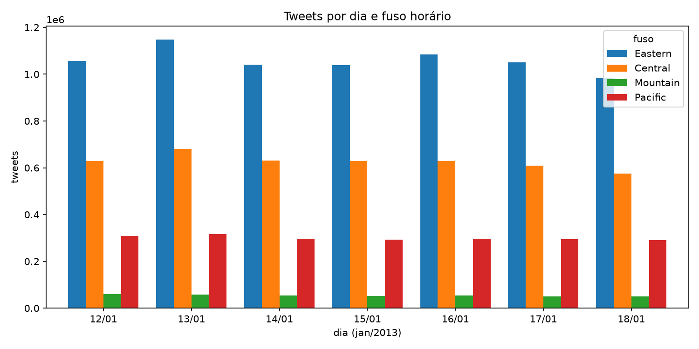
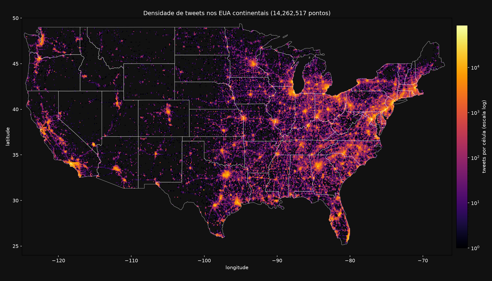
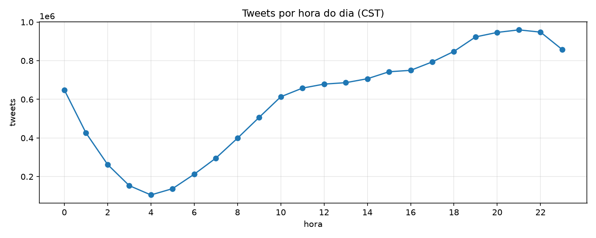

# EDA — Twitter Geospatial Data

Resultados do `src/EDA/eda.py` rodado nos 14.262.517 tweets.

## Qualidade dos dados
- Sem valores ausentes e sem timestamps inválidos.
- Nenhum ponto fora dos EUA continentais.
- 28.954 linhas duplicadas (0,2%). Decisão: manter.
- Período: 12/01/2013 00:00:00 a 18/01/2013 23:59:55.

## Tweets por fuso

| Fuso | Tweets | % |
|---|---|---|
| 1 Eastern | 7.404.613 | 52% |
| 2 Central | 4.382.578 | 31% |
| 4 Pacific | 2.094.968 | 15% |
| 3 Mountain | 380.358 | 3% |

## Gráficos

### Dia × fuso (`dia_fuso.png`)

- Volume estável: ~2 milhões de tweets por dia.
- Maior dia: 13/01 (domingo). Menor: 18/01 (sexta).
- A proporção entre os fusos é a mesma todos os dias.

### Mapa de densidade (`mapa_eua.png`)

- Os tweets desenham cidades e rodovias.
- Metade leste muito mais densa que o Oeste.
- Centro-oeste quase vazio, com pontos isolados (Denver, Salt Lake City, Phoenix).

### Tweets por hora (`tweets_por_hora.png`)

- Mínimo às 4h CST (~105 mil) e pico às 21h CST (~960 mil), quase 9 vezes mais.
- A hora é CST para todos. Como 52% dos tweets são do Eastern, o pico local deles é ~22h.
